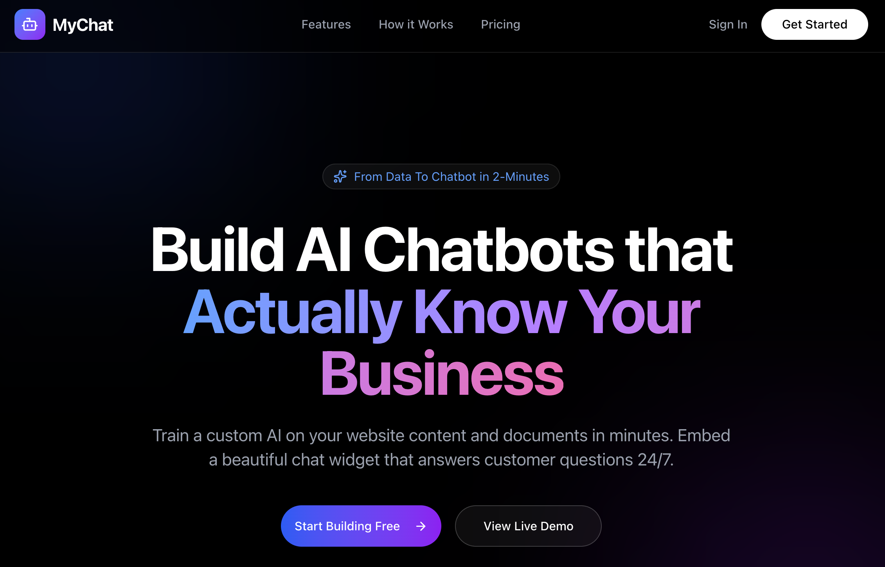

# MyChat - AI Chatbot Builder

[](https://opensource.org/licenses/MIT)
[](https://nodejs.org/)
[](https://nextjs.org/)

MyChat is a powerful tool that allows users to build custom AI chatbots trained on their own data (websites, PDFs, text). It provides a seamless experience for managing knowledge bases, training models, and embedding chat widgets into external websites.

> **Build your own AI chatbot in minutes** — no coding required!



## 🚀 Features

### Core Functionality
-   **Chat Spaces**: Create and manage distinct chat environments (limited to 1 on Free Plan).
-   **Knowledge Base Management**:
    -   **Multi-format Support**: Upload **PDF, DOCX, HTML, TXT, and Markdown** files.
    -   **URL Scraping**: Recursively scrapes websites (up to 10 pages) to build a knowledge base.
    -   **Manual Entry**: Direct text input with character limits and preview.
-   **Widget Control**:
    -   **Status Management**: Toggle between **Testing** (badge visible), **Live**, and **Maintenance** (chat disabled) modes.
    -   **Embeddable Widget**: A lightweight, customizable chat widget.
-   **AI Personalization**:
    -   **Response Tone**: Configure the AI's personality (Professional, Friendly, Enthusiastic, etc.).
    -   **Knowledgebase Connectors**: Connect external knowledge bases (Premium feature).
-   **RAG Pipeline**:
    -   Automated content chunking and embedding generation using **Qwen 2.5** (via OpenRouter).
    -   Vector search using cosine similarity (SQLite-compatible implementation).
    -   Context-aware responses using **Gemini 2.5 Flash** (via OpenRouter).

### User Experience
-   **Modern Dashboard**: Built with **Next.js** and **Shadcn UI** for a premium look and feel.
-   **Real-time Feedback**: Toast notifications, processing status indicators, and "thinking" animations.
-   **Markdown Support**: Rich text rendering in chat responses (code blocks, tables, lists).
-   **Dark/Light Mode**: Fully supported theme switching.

### Free Plan Limits (Enforced)
-   **Chat Spaces**: Max 1.
-   **Links**: Max 10 URLs per space.
-   **Documents**: Max 5 files per space (PDF, DOCX, etc.).
-   **Data Usage**: Max 5 MB processed text per space.

## 🛠 Tech Stack

### Frontend
-   **Framework**: Next.js 15 (App Router)
-   **Styling**: Tailwind CSS, Tailwind Typography
-   **Components**: Shadcn UI (Radix Primitives)
-   **Icons**: Lucide React
-   **State/Feedback**: React Hot Toast

### Backend
-   **Runtime**: Node.js
-   **Framework**: Express.js
-   **Database**: SQLite (with Sequelize ORM)
-   **AI/ML**:
    -   OpenAI SDK (configured for OpenRouter)
    -   Cheerio (Web Scraping)
    -   PDF Parse

## 📦 Installation & Setup

### Prerequisites
-   Node.js (v18+)
-   npm

### 1. Clone the Repository
```bash
git clone <repository-url>
cd mychat
```

### 3. Docker Setup (Recommended)

You can run the entire stack using Docker Compose. This is the easiest way to get started.

**Development Mode (with Hot Reload)**
```bash
docker-compose up --build
```
- Frontend: `http://localhost:3000`
- Backend: `http://localhost:6002`
- Changes to source files will automatically trigger updates.

**Production Mode**
To run in production mode, you would typically build optimized images. For now, the provided Dockerfiles are configured for development.

### 4. Manual Setup (Alternative)

If you prefer to run without Docker:

#### Backend Setup
Navigate to the backend directory and install dependencies:
```bash
cd backend
npm install
```

Create a `.env` file in `backend/` with the following variables:
```env
PORT=6002
JWT_SECRET=your_super_secret_jwt_key
OPENROUTER_API_KEY=your_openrouter_api_key
```

Start the backend server:
```bash
npm run dev
```
The backend will run on `http://localhost:6002`.

#### Frontend Setup
Navigate to the frontend directory and install dependencies:
```bash
cd ../frontend
npm install
```

Start the frontend development server:
```bash
npm run dev
```
The frontend will run on `http://localhost:3000`.

## 🗄 Database & Migrations

The project uses **SQLite** for simplicity and portability. The database file is located at `backend/dev.db`.

### Schema
-   **Users**: Authentication and account details.
-   **ChatSpaces**: Configuration for chatbots (name, prompt, limits).
-   **Documents**: Source files/URLs and their processing status.
-   **DocumentChunks**: Vector embeddings and text chunks for RAG.
-   **Conversations**: Chat session history.
-   **Messages**: Individual chat messages.

### Migrations
We currently use Sequelize's `sync({ alter: true })` for automatic schema updates during development.
For production-grade changes or manual fixes, SQL migration files can be placed in `backend/migrations/` and applied via `sqlite3`.

## 📝 Usage Guide

1.  **Sign Up**: Create an account on the frontend.
2.  **Create Space**: Create your first Chat Space.
3.  **Train**: Add a URL (e.g., your documentation site) or paste text. Click "Process & Train".
4.  **Test**: Use the "Preview Chat" tab to test the bot's responses.
5.  **Embed**: Go to "Settings", copy the script tag, and paste it into your website's HTML.

## � Validating the Widget

We've included a `demo.html` file in the root directory to help you test the widget integration locally.

1.  **Ensure Backend is Running**: The backend must be running on `http://localhost:6002` to serve the widget script.
2.  **Get Your Space ID**:
    -   Go to your Chat Space dashboard.
    -   Navigate to **Settings** -> **Embed**.
    -   Copy the `data-chat-space` ID from the code snippet.
3.  **Update Demo File**:
    -   Open `demo.html` in a text editor.
    -   Replace the `data-chat-space` value in the `<script>` tag with your actual Space ID.
4.  **Run the Demo**:
    Due to CORS restrictions, you cannot simply open the file in your browser. You must serve it locally.
    
    **Using Python (Pre-installed on macOS/Linux):**
    ```bash
    # Run this in the project root
    python3 -m http.server 8000
    ```
    Then open `http://localhost:8000/demo.html`

    **Using Node.js:**
    ```bash
    npx serve .
    ```
    Then open the URL provided (usually `http://localhost:3000/demo.html`)

## 🤝 Contributing

We welcome contributions from the community! Here's how you can help:

1.  **Fork the repository** and clone it locally.
2.  **Create a feature branch**: `git checkout -b feature/amazing-feature`
3.  **Commit your changes**: `git commit -m 'Add some amazing feature'`
4.  **Push to the branch**: `git push origin feature/amazing-feature`
5.  **Open a Pull Request** with a clear description of your changes.

### Development Guidelines
- Follow the existing code style and conventions.
- Write clear, descriptive commit messages.
- Add tests for new features where applicable.
- Update documentation as needed.

## ☁️ Commercial Support & Hosting

While MyChat is fully open-source and free to self-host, we offer commercial options for teams and businesses that need additional support:

### Cloud Hosting
- **Managed Infrastructure** — We handle deployment, scaling, and maintenance so you can focus on your business.
- **Automatic Updates** — Always run the latest version with security patches and new features.
- **High Availability** — Enterprise-grade uptime with redundant infrastructure.

### Enterprise Enhancements
- **Custom Integrations** — Connect MyChat with your existing tools (CRM, helpdesk, analytics).
- **Advanced Analytics** — Deep insights into chatbot performance and user interactions.
- **Priority Support** — Direct access to our engineering team for faster issue resolution.
- **SLA Guarantees** — Tailored service level agreements for business-critical deployments.

### Get in Touch
For cloud hosting, enterprise features, or custom development inquiries:

📧 **Email**: [dhaval@appgambit.com](mailto:dhaval@appgambit.com)

## 📄 License

This project is licensed under the MIT License - see the [LICENSE](LICENSE) file for details.
